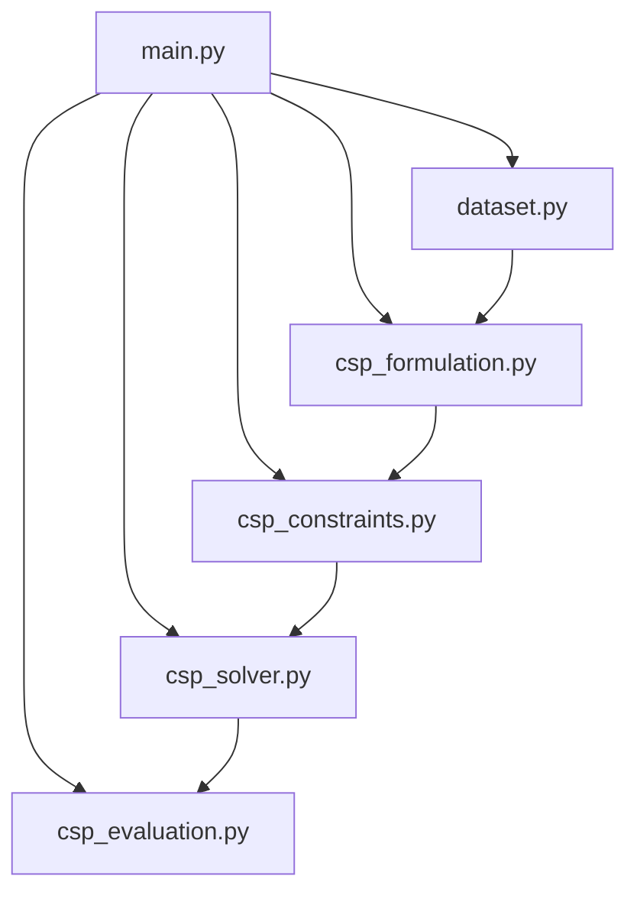

# Projeto IA: Agendamento de Aulas usando CSP

> Sistema inteligente para resolver o problema de agendamento de aulas numa instituição de ensino superior, utilizando **Constraint Satisfaction Problems (CSP)**.

## Informações do Projeto

**Disciplina:** Inteligência Artificial  
**Ano Letivo:** 2025/2026  
**Instituição:** IPCA - Instituto Politécnico do Cávado e do Ave

### Equipa - Grupo 04

| Número | Nome             | GitHub |
|--------|------------------|--------|
| 25447  | Ricardo Marques  | - |
| 25446  | Vitor Leite      | - |
| 25453  | Pedro Vilas Boas | [@ipca-pedro](https://github.com/ipca-pedro) |
| 25275  | Filipe Ferreira  | - |
| 25457  | Danilo Castro    | - |

## Objetivos do Projeto

Desenvolver um sistema de agendamento automático que:
- Resolve conflitos de horários entre professores e turmas
- Otimiza a distribuição de aulas ao longo da semana
- Suporta aulas presenciais e online
- Maximiza a qualidade do horário através de preferências

### Características Principais

- **30 lições** (15 UCs × 2 lições cada)
- **4 professores** com disponibilidades específicas
- **3 turmas** com restrições de conflitos
- **Aulas online** com coordenação especial
- **Sistema de pontuação** para qualidade do horário
- **Resolução rápida** (10-60 segundos)

## Estrutura do Projeto

```
IA25_P01_G04/
├── README.md                      # Este ficheiro
├── README_DETALHADO.md            # Documentação técnica completa
├── requirements.txt               # Dependências Python
├── main.py                        # Módulo principal com menu de execução
├── dataset.py                     # Configuração de dados e restrições
├── csp_formulation.py             # Formulação CSP (variáveis e domínios)
├── csp_constraints.py             # Implementação das restrições hard
├── csp_solver.py                  # Algoritmos de resolução CSP
├── csp_evaluation.py              # Avaliação e apresentação de resultados
├── timetabling_csp.py             # [LEGACY] Código monolítico original
└── mapa_aulas_completo.ipynb      # Notebook Jupyter estruturado
```

---

## Instalação e Configuração

### 1. Clonar o Repositório

```bash
git clone https://github.com/ipca-pedro/IA25_P01_G04.git
cd IA25_P01_G04
```

### 2. Instalar Dependências

```bash
pip install -r requirements.txt
```

**Dependências necessárias:**
- `python-constraint` - Biblioteca para resolução de CSP

---

## Como Executar

### Execução Modular (Recomendado)

```bash
python main.py
```

**Menu Interativo:**
```
========================================
    SISTEMA CSP - AGENDAMENTO AULAS
========================================
1. Apenas Formulação CSP (Fase 1)
2. Resolução Completa (Fase 2) 
3. Ambas as Fases
0. Sair

Escolha uma opção: 
```

### Outras Opções de Execução

```bash
# Código original (monolítico)
python timetabling_csp.py

# Análise interativa
jupyter notebook mapa_aulas_completo.ipynb
```
---

## Arquitetura Modular

### Fluxo de Execução



### Módulos do Sistema

| Módulo | Responsabilidade | Fase |
|--------|------------------|------|
| `dataset.py` | Configuração de dados (UCs, professores, salas) | Setup |
| `csp_formulation.py` | Definição de variáveis e domínios CSP | Fase 1 |
| `csp_constraints.py` | Implementação das restrições hard | Fase 1 |
| `csp_solver.py` | Algoritmos de busca e resolução | Fase 2 |
| `csp_evaluation.py` | Avaliação de qualidade e apresentação | Fase 2 |
| `main.py` | Interface principal e orquestração | - |

## Formulação CSP

### Variáveis e Domínios

- **Variáveis**: 30 variáveis no formato `(UC, lição)`
  - 15 UCs: `UC11, UC12, UC13, UC21, UC22, UC23, UC31, UC32, UC33, UC41, UC42, UC43, UC51, UC52, UC53`
  - 2 lições por UC: `{1, 2}`

- **Domínio**: Cada variável pode assumir valores `(slot_temporal, sala)`
  - **Slots**: 20 slots (5 dias × 4 slots/dia)
  - **Salas**: `{RoomA, RoomB, RoomC, Lab01, Online}`

### Restrições Hard (Obrigatórias)

| # | Restrição | Descrição |
|---|-----------|-----------|
| 1 | **Unicidade** | Duas aulas não podem ocorrer no mesmo (slot, sala) |
| 2 | **Conflito Professores** | Professor não pode dar duas aulas simultaneamente |
| 3 | **Conflito Turmas** | Turma não pode ter duas aulas simultâneas |
| 4 | **Limite Diário** | Máximo 3 aulas por dia por turma |
| 5 | **Coordenação Online** | Aulas online devem ocorrer no mesmo dia |
| 6 | **Limite Online** | Máximo 3 aulas online por dia |

### Restrições Soft (Otimização)

| Critério | Pontuação | Objetivo |
|----------|-----------|----------|
| **Distribuição Temporal** | +10 pts/UC | Lições da mesma UC em dias diferentes |
| **Distribuição Semanal** | +20 pts/turma | Turmas com aulas em 4+ dias |
| **Minimização Salas** | -2 pts/sala | Reduzir número de salas por turma |
| **Consecutividade** | +5 pts/dia | Aulas consecutivas no mesmo dia |

---

## Resultados e Performance

### Exemplo de Output

```bash
============================================================
FORMULAÇÃO CSP - AGENDAMENTO DE AULAS
============================================================

1. VARIÁVEIS:
   Total: 30 variáveis
   Estrutura: 15 UCs × 2 lições = 30 variáveis

2. DOMÍNIOS:
   Média de valores por variável: 78.5
   Espaço de busca: ~10^58

============================================================
RESOLUÇÃO CSP - PROCURANDO SOLUÇÃO
============================================================

[OK] Solução encontrada em 15.234 segundos
[OK] Avaliação concluída em 0.012 segundos

============================================================
SOLUÇÃO ENCONTRADA (Pontuação: 85)
============================================================

Turma t01:
  Segunda, 08:00: UC11_L1 [RoomA] - Prof. p01
  Segunda, 09:00: UC12_L1 [RoomB] - Prof. p02
  ...
```

### Métricas de Performance

| Métrica | Valor Típico | Descrição |
|---------|--------------|-----------|
| **Tempo de Execução** | 10-60s | Dependente da complexidade das restrições |
| **Taxa de Sucesso** | 100% | Sempre encontra solução válida |
| **Pontuação Média** | 70-90 pts | Qualidade do horário gerado |
| **Espaço de Busca** | ~10^58 | Combinações possíveis teóricas |

---

